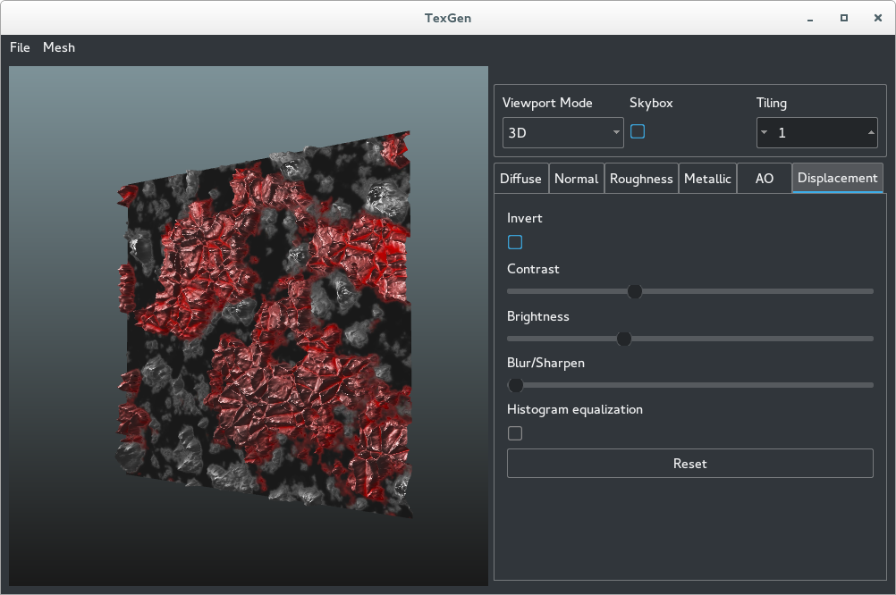

# TexGen

We propose the implementation of a software that aims at speeding up the work-flow of texture artists and that can help generalists to quickly generate texture maps without having to use multiple programs and complex procedures. 

  

### Dependencies
* [Qt]( https://www.qt.io/ ) - QtCreator was our IDE of choice, we also used [QWidget](http://doc.qt.io/qt-5/qwidget.html) and [QImage](http://doc.qt.io/qt-5/qimage.html)
* [OpenGL](https://www.opengl.org/) ( 4.1 ) - used for previews and the 3D Viewport
* [OpenCL](https://www.khronos.org/opencl/) - used to calculate the Normal Maps

### Configuration
* qmake
* make -j
* ./TexSketch

Alterntively open the project in QtCreator, build and run the project

### Instructions

* File/open to load an image and get started editing, works in 2D mode
* File/Save to save the currently open map, works in 2D mode
* File/Save all to save all the maps, works regardless of the mode
* Mesh/Load mesh to change the mesh displayed in 3D mode, works in 3D mode only with triangulated meshes for now
